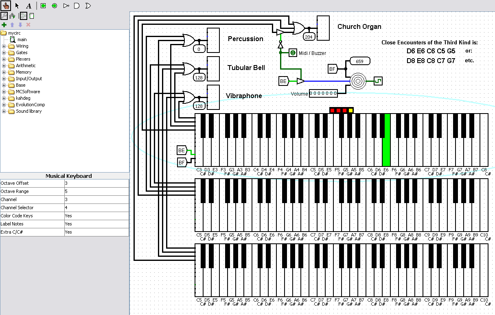

MIDI and Sound Buzzer Musical Keyboard for Logisim
==================================================

 
## Introduction

This is a musical keyboard for the Logisim circuit simulation program.  It's
used in conjunction with a midi device component and/or a sound buzzer
component.  It should work with either original Logisim or Logisim Evolution.
I can't guarantee it will work with future Evolution versions, since they
often change the parameters of various functions and even function names
(therefore, not backwards compatible).

This screenshot shows a sample circuit using my keyboard.  This circuit uses
an improved version of kahdeg's midi device.  The improvements I made were to
make it faster and more responsive, to add the ability to change instrument and
channel, and to add default capabilities in case you don't want to wire up
volume line, etc.  If you choose to use kahdeg's original midi device, some
changes to the sample circuits would be required (7 bit note value, and volume,
and maybe on/off lines added), and it won't be as responsive.

In my midi keyboard, you can select which keyboard channel the output goes on
by using the parameter attributes at the lower left side of the Logisim window,
or clicking on the appropriate square on the channel selector (red and yellow
boxes), or providing a 3-bit input on the channel line.  The channel line
overrides the channel selector which overrides the parameter attribute.

You can press each keyboard key for a short time, or a long time, or even drag
across many keys (just like a real piano/synthesizer).

You can also use the sound buzzer JAR library instead of kahdeg's midi device.
EXCEPT, the sound buzzer won't work in Logisim Evolution (If I had access to
the source code, I could make it work, but I don't have the source).

If you have more than one keyboard in the circuit, one keyboard (randomly
chosen each time you load the circuit) will have the keys color painted
perfectly when pressed, the other keyboards will have a slight overlapping
error when pressed.  I'm pretty sure this is a Logisim problem and not a
problem with my code.  I think it has to do with the way most things in
Logisim are somewhat transparent.  You can see this in my channel selector -
I first paint a black box fully filled in with black, then paint colored
squares on top.  If you notice, the colored squares show the background
underneath even though what should technically be underneath is black.  I
believe, in certain cases, Logisim gets confused about what should be "on top",
see-through, etc.  I have noticed this random overlapping change in other
components as well.

BTW, if you choose to have a keyboard which, for example, uses the full 11
octave range, you will probably want to zoom out by clicking on the arrows at
the bottom-left area of the Logisim window.

If you don't have Logisim, here's a link to the original Logisim:
[https://sourceforge.net/projects/circuit/files/2.7.x/2.7.1/logisim-generic-2.7.1.jar/download](https://sourceforge.net/projects/circuit/files/2.7.x/2.7.1/logisim-generic-2.7.1.jar/download)
for a JAR file (which would be needed for building this component if you need to) and
[https://sourceforge.net/projects/circuit/files/latest/download](https://sourceforge.net/projects/circuit/files/latest/download)
for an executable version.

If using the JAR version, you would need to do the following to run it:

    java -jar logisim-generic-2.7.1.jar

## Building

JAR file is included, so there shouldn't be a need to build, but if you need
to...

Edit Makefile accordingly (to set filename and location of your Logisim program jar file (exe file will not work)).  Also, you must have Java JDK installed -
probably needs to be at least version 7.

On Windows (assuming Microsoft Visual Studio and assuming DOS compiling
environment set up.  Adjust accordingly for other IDEs):

    nmake

On Linux:

    make -f Makefile.unix

## Other Logisim JAR Libraries That Will/May Be Needed

* [My Midi component (based on kahdeg's)](https://sites.google.com/site/mrmcsoftware/home/downloads/mididevice.zip)
* [Sound Buzzer](https://sites.google.com/site/immibis/home/files/buzzer.jar)

BTW, the buzzer's main class name is: immibis.buzzer.Library

## Sample Circuit Files

mycirc2.circ and mycirc2e.circ use the Channel selection line to set the
channel of the keyboard.  The selection lines can be changed by adjusting the
selection pins below and to the left of the keyboards.  The selection lines
override the channel selector boxes (if enabled) on top of the keyboards.

mycirce.circ and mycirc2e.circ are for Logisim Evolution.

__
mycircekw.circ is specifically for newer versions of Kevin Walsh's Holy Cross
Logisim.  For some reason, many of the unused pins on the midi keyboard and the
midi device have to have a wire connected in order to work (even though the wire
isn't connected to anything).  So, this circuit file does that.  Older versions
of Holy Cross Logisim don't have this problem.  Note: it is possible that this
problem would go away if the two components were re-compiled using at least
version 11 of (Java) JDK along with the Holy Cross Logisim JAR file.
__

If you don't have the instruments I use in these circuits, you will get some
errors on loading.  Just add the midi device components back that were
eliminated and set the instrument.

## Demonstration Videos

[YouTube video link set to the start of the MIDI keyboard](https://www.youtube.com/watch?v=_VW074myq44&t=1m36s)

[The full youtube video (also showing my CPU design)](https://www.youtube.com/watch?v=_VW074myq44)

## Pet Peeves

In my opinion, method overloading / polymorphism is one of the most useful
features of object oriented programming / languages.  So, why don't the
maintainers of the various Logisim (Evolution) forks use this feature?  Java
has (in my opinion) a serious flaw - no unsigned variables.  Because of this
flaw, an int value that has it's most significant bit set to 1, is negative.
This has caused many problems with Logisim (32-bit values mostly need to be
positive).  The solution to this is to change critical int's to long's making
them 64-bit - the 32nd bit can be set to 1 without the variable being negative,
and since Logisim is max 32-bit, no component should ever set the 64th bit
(would therefore never be negative).  The maintainers of the various Logisim
forks just changed int to long, and method names from int to long
(toIntValue becomes toLongValue for example).  The problem with this practice
is that all the JAR libraries are looking for toIntValue and there's no longer
a toIntValue.  Why didn't they keep the toIntValue and make a practically
duplicate toLongValue?  And why didn't they keep functions that have int
parameters (such as createKnown) and make practically duplicate functions that
have long parameters?  Method overloading would just use the appropriate one.
Admittedly, I don't know if there would be a performance hit by doing this,
or how big of a hit if there was.  Though, I know keeping toIntValue shouldn't
cause a hit (since it doesn't overload).

Probably the worst example is the decision to change getPort to getPortValue.
I'm sure some software engineering minded person thought it was more accurate
to call it getPortValue since it returns a Value.  This is software engineering
run amok.  So, you're gonna sacrifice backwards-compatibility with existing
JAR libraries because the name is more accurate??!  And this is even worse
because it makes no sense, since setPort is still setPort even though it sets
the port with a Value!  How about duplicate getPort to getPortValue or
even have getPort just call getPortValue if a less precise name offends you so
much.

So, if you want to create a JAR library that works in all versions of existing
Logisims, you have to use Java's reflection capability and make a mess of
your code.  And, of course, there's no guarantee it will still work in the
future because who knows what they'll change next.  And people wonder why there
aren't more Logisim JAR libraries out there.

Having said all that, I know Logisim is a big, complicated program source-wise,
with lots of classes.  It's still an impressive accomplishment by both the
creator and the maintainers.  I don't mean to diminish that accomplishment.

## Author

Mark Craig
[https://www.youtube.com/MrMcSoftware](https://www.youtube.com/MrMcSoftware)
